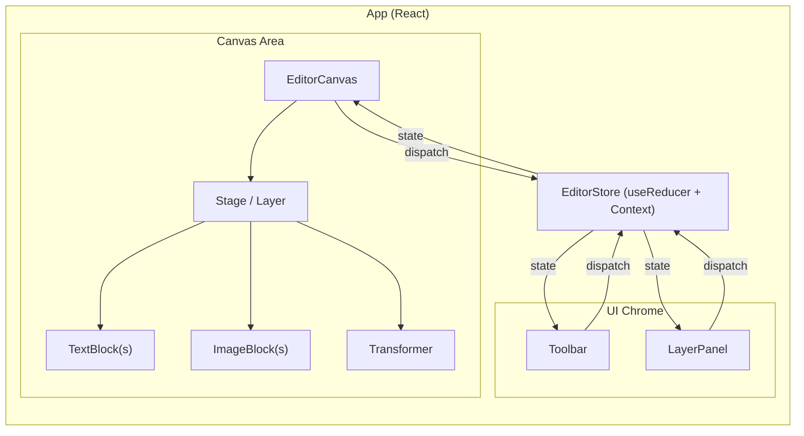
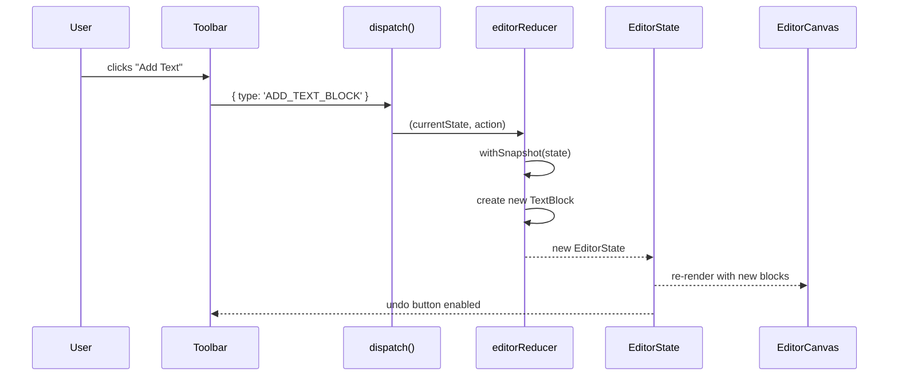

# Design Document: Ad Template Editor

## Overview

The Ad Template Editor is a single-page React + TypeScript application that lets users compose ad creatives on a 2D canvas. It uses `react-konva` (the React binding for the Konva.js HTML5 canvas library) to render and manipulate visual blocks — text and images — with drag, resize, and rotate interactions. A layer panel provides stacking control, an undo/redo history stack enables safe experimentation, and a one-click PNG export produces campaign-ready output.

The design prioritizes a small, cleanly architected codebase with clear separation between canvas rendering, state management, and UI chrome. The visual style draws from Smartly's design language: neutral backgrounds, subtle borders, compact controls, and a professional, tool-like aesthetic.

### Why react-konva?

Konva.js is a 2D canvas framework that provides a scene graph (Stage → Layer → Shape) on top of the HTML5 `<canvas>` element. `react-konva` wraps this in React components so you can declaratively describe your canvas scene:

```tsx
<Stage width={800} height={600}>
  <Layer>
    <Rect x={0} y={0} width={800} height={600} fill="white" />
    <Text x={100} y={100} text="Hello" fontSize={24} draggable />
  </Layer>
</Stage>
```

Key concepts:

- **Stage**: The root container, maps to a `<canvas>` DOM element.
- **Layer**: A grouping inside the Stage. Each Layer gets its own internal canvas for performance. For this editor, a single Layer is sufficient.
- **Shapes**: `Rect`, `Text`, `Image`, `Transformer`, etc. These are Konva nodes exposed as React components.
- **Transformer**: A special Konva node that attaches to a shape and renders resize/rotate handles. You attach it by setting its `nodes` prop to an array of Konva node refs.
- **Events**: Konva shapes emit events like `onDragEnd`, `onTransformEnd`, `onClick`, `onDblClick`. These are the primary way to capture user interactions on the canvas.

The declarative model means our React state drives what's on the canvas — we update state, react-konva re-renders the scene.

## Architecture



### Architectural Decisions

1. **Single `useReducer` + React Context for state** — The editor state is a single object (blocks, selection, history). A reducer gives us predictable state transitions, makes undo/redo natural (snapshot the state), and avoids prop-drilling. No external library needed for this scope.

2. **Single Konva Layer** — Multiple layers add complexity (cross-layer hit detection, separate canvases). With a modest number of blocks (typical ad: 5–15 elements), one Layer performs well and simplifies the code.

3. **Immutable state snapshots for history** — Each action produces a new state object. The history stack stores these snapshots. Undo/redo simply swaps the current state pointer. This is simple and correct, at the cost of memory — acceptable for a small editor.

4. **Inline text editing via HTML overlay** — Konva's `Text` node doesn't support native text editing. The standard pattern is to hide the Konva text, overlay an HTML `<textarea>` at the same position, and sync on blur. This is the approach used by Konva's own examples.

5. **Component-per-block-type** — `TextBlock` and `ImageBlock` are separate components that encapsulate their Konva shape rendering and event handling. This keeps the canvas component clean and makes it easy to add new block types later.

## Components and Interfaces

### Component Tree

```
App
├── EditorProvider (context + reducer)
│   ├── Toolbar
│   │   ├── AddTextButton
│   │   ├── AddImageButton
│   │   ├── UndoButton
│   │   ├── RedoButton
│   │   └── ExportButton
│   ├── EditorCanvas
│   │   └── Stage > Layer
│   │       ├── BackgroundRect
│   │       ├── ImageBlock (per image block)
│   │       ├── TextBlock (per text block)
│   │       └── TransformerComponent
│   └── LayerPanel
│       └── LayerItem (per block)
```

### Key Interfaces

```typescript
// ---------- Actions dispatched to the reducer ----------

type EditorAction =
  | { type: "ADD_TEXT_BLOCK" }
  | { type: "ADD_IMAGE_BLOCK"; payload: { imageSrc: string } }
  | { type: "SELECT_BLOCK"; payload: { id: string | null } }
  | { type: "UPDATE_BLOCK"; payload: { id: string; changes: Partial<Block> } }
  | { type: "MOVE_LAYER_UP"; payload: { id: string } }
  | { type: "MOVE_LAYER_DOWN"; payload: { id: string } }
  | { type: "TOGGLE_VISIBILITY"; payload: { id: string } }
  | { type: "UPDATE_TEXT_CONTENT"; payload: { id: string; text: string } }
  | { type: "UNDO" }
  | { type: "REDO" };

// ---------- Context shape ----------

interface EditorContextValue {
  state: EditorState;
  dispatch: React.Dispatch<EditorAction>;
}
```

### Component Responsibilities

| Component              | Role                                                                                                                                                                |
| ---------------------- | ------------------------------------------------------------------------------------------------------------------------------------------------------------------- |
| `EditorProvider`       | Wraps children in context. Owns `useReducer`. Registers keyboard shortcuts (Ctrl+Z, Ctrl+Shift+Z).                                                                  |
| `Toolbar`              | Renders action buttons. Dispatches `ADD_TEXT_BLOCK`, `ADD_IMAGE_BLOCK`, `UNDO`, `REDO`. Handles file picker for images.                                             |
| `EditorCanvas`         | Renders the Konva `<Stage>` and `<Layer>`. Maps `state.blocks` to `TextBlock` / `ImageBlock` components sorted by `layerIndex`. Handles click-on-empty to deselect. | 
| `TextBlock`            | Renders a Konva `<Text>` node. Handles drag, transform end, double-click for inline edit.                                                                           |
| `ImageBlock`           | Renders a Konva `<Image>` node. Handles drag, transform end. Uses `useImage` hook from `react-konva-utils` to load the image source.                                |
| `TransformerComponent` | Renders a Konva `<Transformer>`. Attaches to the selected block's node ref. Enforces min size (20×20).                                                              |
| `LayerPanel`           | Lists blocks in reverse layer order (top-first). Each `LayerItem` shows name, visibility toggle, move up/down buttons.                                              |

## State Management (Deep Dive)

This section explains the state management approach in detail, since understanding the data flow is key to working with this editor.

### Why useReducer + Context?

For a small-to-medium app like this, `useReducer` + React Context is the right tool:

- **Predictable**: Every state change goes through the reducer. You can log every action and see exactly what happened.
- **Testable**: The reducer is a pure function — `(state, action) => newState`. You can unit test it without rendering anything.
- **Undo/redo friendly**: Since the reducer produces a new state object on every action, we can snapshot states trivially.
- **No extra dependencies**: No Redux, Zustand, or Jotai needed. The built-in React APIs are sufficient.

The tradeoff: every state change re-renders all consumers of the context. For this editor (one canvas, one toolbar, one layer panel), that's fine. If performance became an issue, you could split into multiple contexts or use `useMemo` selectively.

### The State Shape

```typescript
interface EditorState {
  /** All blocks currently on the canvas */
  blocks: Block[];
  /** ID of the currently selected block, or null */
  selectedBlockId: string | null;
  /** Whether inline text editing is active */
  isEditingText: boolean;
  /** Undo/redo history */
  history: HistoryState;
}

interface HistoryState {
  /** Stack of past block snapshots (most recent last) */
  past: Block[][];
  /** Stack of future block snapshots for redo (most recent first) */
  future: Block[][];
}
```

### How Undo/Redo Works

The history model is a classic "snapshot stack":

```
past: [S0, S1, S2]    current: S3    future: [S4, S5]
                          ^
                     you are here
```

- **On a new action**: Push current `blocks` onto `past`, clear `future`, apply the action to produce new `blocks`.
- **On undo**: Push current `blocks` onto `future`, pop from `past` to become current `blocks`.
- **On redo**: Push current `blocks` onto `past`, pop from `future` to become current `blocks`.

In code, the reducer handles this:

```typescript
function editorReducer(state: EditorState, action: EditorAction): EditorState {
  switch (action.type) {
    case "UNDO": {
      if (state.history.past.length === 0) return state;
      const previous = state.history.past[state.history.past.length - 1];
      return {
        ...state,
        blocks: previous,
        history: {
          past: state.history.past.slice(0, -1),
          future: [state.blocks, ...state.history.future],
        },
      };
    }
    case "REDO": {
      if (state.history.future.length === 0) return state;
      const next = state.history.future[0];
      return {
        ...state,
        blocks: next,
        history: {
          past: [...state.history.past, state.blocks],
          future: state.history.future.slice(1),
        },
      };
    }
    // ... other actions push snapshot before mutating
  }
}
```

### Helper: Pushing a Snapshot

Most actions need to save the current state before applying changes. A helper keeps this DRY:

```typescript
function withSnapshot(state: EditorState): EditorState {
  return {
    ...state,
    history: {
      past: [...state.history.past, state.blocks],
      future: [], // new action clears redo stack
    },
  };
}

// Usage in reducer:
case 'ADD_TEXT_BLOCK': {
  const snapped = withSnapshot(state);
  const newBlock = createTextBlock(state.blocks.length);
  return { ...snapped, blocks: [...snapped.blocks, newBlock] };
}
```

### Data Flow Diagram



### Konva Event → State Update Flow

When the user drags or transforms a block on the canvas, the flow is:

1. User drags a block → Konva fires `onDragEnd` with the node's new position.
2. The block component reads `e.target.x()` and `e.target.y()`.
3. It dispatches `UPDATE_BLOCK` with the new position.
4. The reducer snapshots the old state, applies the position change, returns new state.
5. React re-renders the canvas with the updated block position.

```typescript
// Inside TextBlock component
const handleDragEnd = (e: Konva.KonvaEventObject<DragEvent>) => {
  dispatch({
    type: "UPDATE_BLOCK",
    payload: {
      id: block.id,
      changes: { x: e.target.x(), y: e.target.y() },
    },
  });
};
```

The same pattern applies to `onTransformEnd` for resize/rotate — you read the node's updated dimensions and rotation, then dispatch.

## Data Models

### Block Types

```typescript
interface BaseBlock {
  id: string; // unique identifier (nanoid or crypto.randomUUID)
  type: "text" | "image";
  x: number; // position on canvas
  y: number;
  width: number;
  height: number;
  rotation: number; // degrees
  layerIndex: number; // stacking order (higher = on top)
  visible: boolean;
  name: string; // display name in LayerPanel (e.g. "Text 1", "Image 2")
}

interface TextBlock extends BaseBlock {
  type: "text";
  text: string; // the actual text content
  fontSize: number;
  fontFamily: string;
  fill: string; // text color, e.g. "#333333"
}

interface ImageBlock extends BaseBlock {
  type: "image";
  imageSrc: string; // data URL or object URL of the loaded image
}

type Block = TextBlock | ImageBlock;
```

### Default Values

```typescript
const TEXT_BLOCK_DEFAULTS: Omit<TextBlock, "id" | "layerIndex" | "name"> = {
  type: "text",
  x: 400, // center of 800-wide canvas
  y: 300, // center of 600-tall canvas
  width: 200,
  height: 50,
  rotation: 0,
  visible: true,
  text: "Edit me",
  fontSize: 24,
  fontFamily: "Arial",
  fill: "#333333",
};

const IMAGE_BLOCK_DEFAULTS: Omit<
  ImageBlock,
  "id" | "layerIndex" | "name" | "imageSrc"
> = {
  type: "image",
  x: 400,
  y: 300,
  width: 200,
  height: 200,
  rotation: 0,
  visible: true,
};
```

### Canvas Constants

```typescript
const CANVAS_WIDTH = 800;
const CANVAS_HEIGHT = 600;
const MIN_BLOCK_SIZE = 20; // minimum width/height enforced by Transformer
```

### State Initialization

```typescript
const initialState: EditorState = {
  blocks: [],
  selectedBlockId: null,
  isEditingText: false,
  history: {
    past: [],
    future: [],
  },
};
```

## Correctness Properties

_A property is a characteristic or behavior that should hold true across all valid executions of a system — essentially, a formal statement about what the system should do. Properties serve as the bridge between human-readable specifications and machine-verifiable correctness guarantees._

### Property 1: Block rendering order matches layerIndex

_For any_ array of blocks with arbitrary layerIndex values, the canvas rendering order and the layer panel display order SHALL both be determined solely by layerIndex — ascending for canvas rendering (higher index on top) and descending for layer panel display (highest first).

**Validates: Requirements 1.3, 8.1**

### Property 2: New blocks receive the highest layerIndex

_For any_ existing set of blocks on the canvas, when a new block (text or image) is added, its layerIndex SHALL be strictly greater than the layerIndex of every existing block.

**Validates: Requirements 2.3, 3.4**

### Property 3: Mutating actions push a history snapshot

_For any_ editor state and any mutating action (add block, update block position/size/rotation, change layer order, toggle visibility, update text content), after the action is applied, `history.past` SHALL contain one more entry than before, and that entry SHALL equal the pre-action blocks array.

**Validates: Requirements 2.4, 3.5, 5.2, 6.2, 7.2, 8.6**

### Property 4: Selection invariant

_For any_ sequence of editor actions, `selectedBlockId` SHALL always be either `null` or the `id` of a block that exists in the current `blocks` array.

**Validates: Requirements 4.4**

### Property 5: Minimum block size constraint

_For any_ block and any resize operation applied through the reducer, the resulting block width and height SHALL both be greater than or equal to 20 pixels.

**Validates: Requirements 6.3**

### Property 6: Layer swap correctness

_For any_ array of blocks and any block that is not at the top (or bottom) of the layer stack, moving it up (or down) SHALL swap its layerIndex with exactly one adjacent block, leaving all other blocks' layerIndices unchanged, and the total set of layerIndex values SHALL be preserved.

**Validates: Requirements 8.2, 8.3**

### Property 7: Visibility toggle is an involution

_For any_ block, toggling its visibility twice SHALL return it to its original visibility state. Formally: `toggle(toggle(block.visible)) === block.visible`.

**Validates: Requirements 8.4**

### Property 8: Only visible blocks are rendered

_For any_ set of blocks with mixed visibility, the set of blocks passed to the canvas for rendering SHALL be exactly the subset where `visible === true`.

**Validates: Requirements 8.5, 10.4**

### Property 9: Undo-redo round trip

_For any_ editor state and any mutating action, performing the action and then undoing SHALL restore the blocks array to its pre-action state. Furthermore, undoing and then redoing SHALL restore the blocks array to its post-action state.

**Validates: Requirements 9.1, 9.2, 9.6**

### Property 10: New action after undo clears redo stack

_For any_ editor state where `history.future` is non-empty (i.e., the user has undone at least one action), performing any new mutating action SHALL result in `history.future` being empty.

**Validates: Requirements 9.5**

## Error Handling

### Image Loading Errors

- If a user selects a file that is not PNG or JPEG, the Toolbar validates the MIME type before dispatching `ADD_IMAGE_BLOCK`. An error message is shown inline (e.g., a toast or inline text below the button): "Only PNG and JPEG images are supported."
- If the selected image fails to load (corrupt file, read error), the `FileReader.onerror` callback triggers an error message and no block is created.
- The `useImage` hook from `react-konva-utils` returns `[image, status]`. If `status === 'failed'`, the `ImageBlock` component renders a placeholder rectangle with an error icon.

### History Stack Boundaries

- Undo when `history.past` is empty: the reducer returns the current state unchanged. The UI disables the Undo button when `past.length === 0`.
- Redo when `history.future` is empty: same pattern — reducer is a no-op, button is disabled.

### Export Errors

- `stage.toDataURL()` can fail if the canvas is tainted (cross-origin images). Since we load images from local file picks (data URLs), this shouldn't occur. As a safety net, the export function wraps the call in a try/catch and shows an error message on failure.

### Invalid State Guards

- `UPDATE_BLOCK` with an `id` that doesn't exist in `blocks`: the reducer returns state unchanged (no-op).
- `MOVE_LAYER_UP` on the top block or `MOVE_LAYER_DOWN` on the bottom block: the reducer returns state unchanged. The UI disables these controls at boundaries.
- `SELECT_BLOCK` with an `id` not in `blocks`: sets `selectedBlockId` to `null`.

## Testing Strategy

### Unit Tests (example-based)

Unit tests cover specific interactions and edge cases using React Testing Library and Jest/Vitest:

- **Canvas initialization**: Stage renders at 800×600 with white background (Req 1.1, 1.2).
- **Add text block**: Click "Add Text" → new text block at center with "Edit me" (Req 2.1).
- **Add image block**: File picker opens, valid image creates block (Req 3.1, 3.2).
- **File validation**: Reject non-PNG/JPEG files with error message (Req 3.6).
- **Selection**: Click block → selected; click empty → deselected; Transformer attaches/detaches (Req 4.1–4.3).
- **Layer panel boundary controls**: Top block has move-up disabled, bottom block has move-down disabled (Req 8.7, 8.8).
- **Undo/redo button state**: Disabled when no past/future snapshots (Req 9.3, 9.4).
- **Inline text editing**: Double-click → textarea overlay; Escape → deactivate (Req 11.1–11.3).
- **Export**: Transformer hidden during export, download triggered with "ad-export.png" (Req 10.1–10.3).

### Property-Based Tests

Property-based tests use `fast-check` to verify universal properties across generated inputs. Each test runs a minimum of 100 iterations.

The reducer is a pure function `(EditorState, EditorAction) => EditorState`, which makes it an ideal target for property-based testing. We generate random editor states and random action sequences, then assert that properties hold.

| Property    | Test Description                                                                                                | Tag                                                                                |
| ----------- | --------------------------------------------------------------------------------------------------------------- | ---------------------------------------------------------------------------------- |
| Property 1  | Generate random block arrays, sort by layerIndex, verify order                                                  | Feature: ad-template-editor, Property 1: Block rendering order matches layerIndex  |
| Property 2  | Generate random block arrays, dispatch add action, verify new block has max layerIndex                          | Feature: ad-template-editor, Property 2: New blocks receive the highest layerIndex |
| Property 3  | Generate random state + mutating action, verify history.past grows by 1                                         | Feature: ad-template-editor, Property 3: Mutating actions push a history snapshot  |
| Property 4  | Generate random action sequences, verify selectedBlockId is null or valid                                       | Feature: ad-template-editor, Property 4: Selection invariant                       |
| Property 5  | Generate random resize operations with small target sizes, verify min 20×20                                     | Feature: ad-template-editor, Property 5: Minimum block size constraint             |
| Property 6  | Generate random block arrays, pick a block, move up/down, verify swap and index preservation                    | Feature: ad-template-editor, Property 6: Layer swap correctness                    |
| Property 7  | Generate random booleans, toggle twice, verify identity                                                         | Feature: ad-template-editor, Property 7: Visibility toggle is an involution        |
| Property 8  | Generate random blocks with mixed visibility, filter, verify only visible remain                                | Feature: ad-template-editor, Property 8: Only visible blocks are rendered          |
| Property 9  | Generate random state + action, apply then undo, verify blocks restored; undo then redo, verify blocks restored | Feature: ad-template-editor, Property 9: Undo-redo round trip                      |
| Property 10 | Generate state with non-empty future, dispatch mutating action, verify future is empty                          | Feature: ad-template-editor, Property 10: New action after undo clears redo stack  |

### Test Tooling

- **Test runner**: Vitest (fast, TypeScript-native, compatible with React Testing Library)
- **Component tests**: `@testing-library/react` for DOM-based assertions
- **Property-based testing**: `fast-check` for generating random inputs and verifying properties
- **Konva mocking**: `jest-canvas-mock` or `canvas` package to provide a canvas implementation in Node.js for Konva rendering in tests
