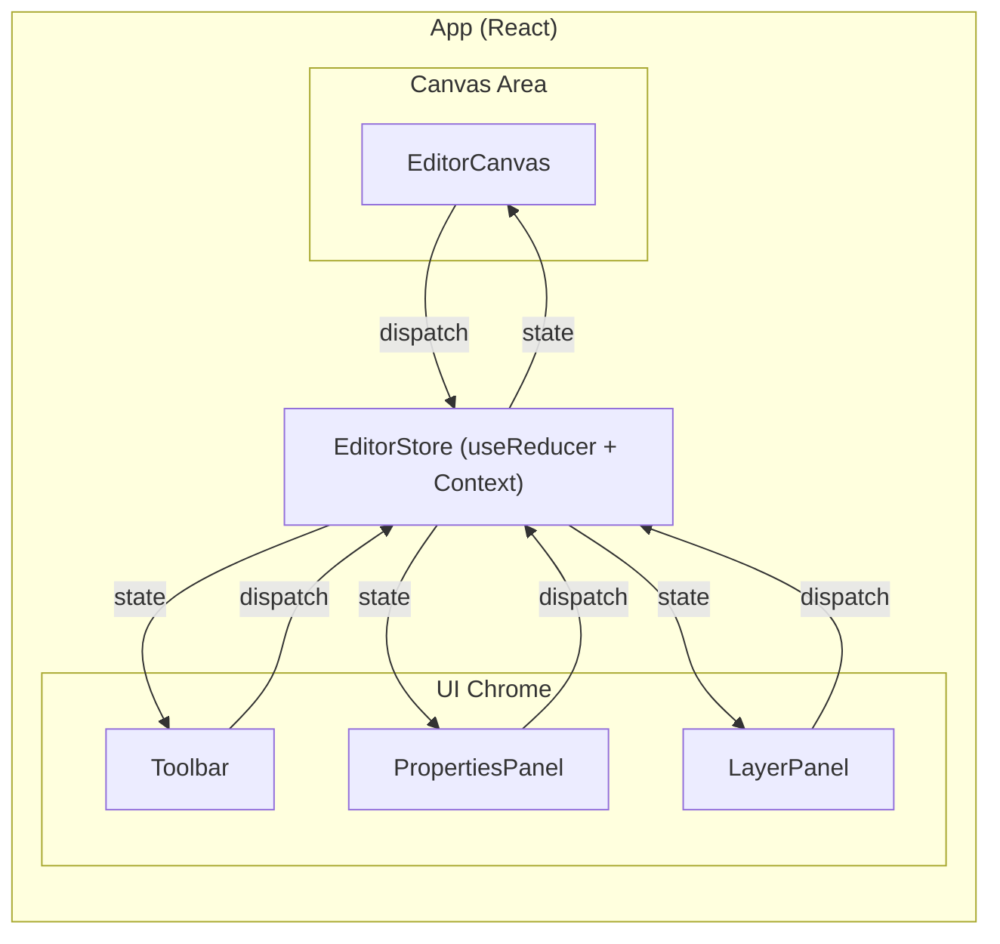
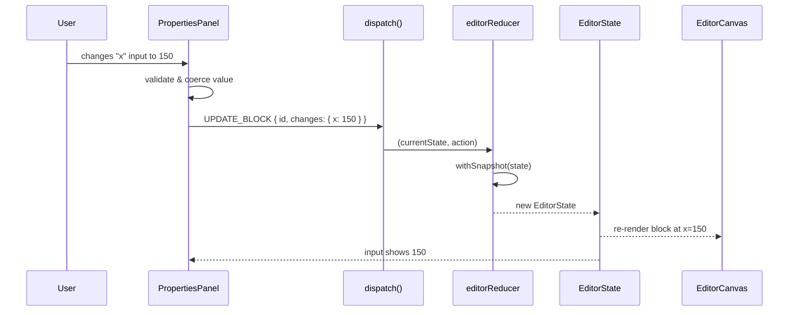

# Design Document: Properties Panel

## Overview

The Properties Panel is a sidebar component for the Ad Template Editor that displays and allows editing of the currently selected block's properties. It reads from the existing `EditorContext` and dispatches `UPDATE_BLOCK` and `UPDATE_TEXT_CONTENT` actions to modify block state.

The panel is contextual — it shows different controls depending on the selected block's type:

- **All blocks**: position (x, y), size (width, height), rotation
- **Text blocks**: text content, font size, font family (dropdown), fill color
- **Image blocks**: thumbnail preview of the image source
- **No selection**: an empty-state message

The panel slots into the existing layout between the canvas area and the layer panel, using the same styling conventions (fixed width, neutral background, subtle borders).

### Design Decisions

1. **Single component with conditional sections** — Rather than separate `TextPropertiesPanel` and `ImagePropertiesPanel` components, a single `PropertiesPanel` component renders common fields for all blocks and conditionally renders type-specific sections. This keeps the component tree flat and avoids duplicating the common fields logic.

2. **Controlled inputs bound to state** — Each input field is a controlled React input whose value comes from the selected block's state. On change, the component dispatches the appropriate action. This ensures the panel always reflects the current state, including changes made via canvas interactions (drag, resize, rotate).

3. **Validation at the component level** — Minimum value coercion (width/height ≥ 20, fontSize ≥ 1) happens in the `onChange` handler before dispatching. The reducer already enforces min block size, but coercing in the panel gives immediate feedback and avoids dispatching invalid values.

4. **Number inputs with `type="number"`** — Using HTML `<input type="number">` provides native numeric validation and step controls. The `onBlur` handler applies coercion for minimum values.

## Architecture



The Properties Panel is a peer of the Toolbar and LayerPanel — it reads `state` from `EditorContext` and dispatches actions back. No new state management infrastructure is needed.

### Data Flow



## Components and Interfaces

### Updated Component Tree

```
App
├── EditorProvider (context + reducer)
│   ├── Toolbar
│   ├── EditorCanvas
│   │   └── Stage > Layer > TextBlock / ImageBlock / Transformer
│   ├── PropertiesPanel        ← NEW
│   └── LayerPanel
```

### PropertiesPanel Component

```typescript
// src/components/PropertiesPanel.tsx

function PropertiesPanel(): JSX.Element;
```

**Responsibilities:**

- Read `state.selectedBlockId` and `state.blocks` from `useEditor()`
- Find the selected block (if any)
- Render empty-state message when no block is selected
- Render common property inputs (x, y, width, height, rotation) for any selected block
- Conditionally render text-specific controls (text, fontSize, fontFamily, fill) for TextBlocks
- Conditionally render image thumbnail for ImageBlocks
- Dispatch `UPDATE_BLOCK` for spatial and text-style property changes
- Dispatch `UPDATE_TEXT_CONTENT` for text content changes
- Coerce minimum values on blur (width/height ≥ 20, fontSize ≥ 1)

**Props:** None — reads entirely from context.

### Helper: `NumberInput`

A small inline helper (not a separate file) to reduce repetition for numeric fields:

```typescript
interface NumberInputProps {
  label: string;
  value: number;
  onChange: (value: number) => void;
  min?: number;
  step?: number;
}
```

This renders a `<label>` + `<input type="number">` pair, handles parsing, and applies min-value coercion on blur.

### Updated App Layout

```typescript
// src/App.tsx — updated layout
<div className="app-body">
  <div className="canvas-area">
    <EditorCanvas />
  </div>
  <PropertiesPanel />    {/* NEW — between canvas and layer panel */}
  <LayerPanel />
</div>
```

### Actions Used

No new reducer actions are needed. The panel uses existing actions:

| Action                | When                                                                      |
| --------------------- | ------------------------------------------------------------------------- |
| `UPDATE_BLOCK`        | User changes x, y, width, height, rotation, fontSize, fontFamily, or fill |
| `UPDATE_TEXT_CONTENT` | User changes text content for a TextBlock                                 |

## Data Models

No new types or state changes are required. The panel reads from the existing `EditorState` and dispatches existing `EditorAction` types.

### Font Family Options

A constant array for the font family dropdown:

```typescript
const FONT_FAMILIES = [
  "Arial",
  "Helvetica",
  "Times New Roman",
  "Georgia",
  "Courier New",
  "Verdana",
] as const;
```

This can live in `PropertiesPanel.tsx` or in `constants.ts`.

### Validation Constants

```typescript
const MIN_BLOCK_SIZE = 20; // already exists in constants.ts
const MIN_FONT_SIZE = 1; // new, can be added to constants.ts or kept local
```

## Correctness Properties

_A property is a characteristic or behavior that should hold true across all valid executions of a system — essentially, a formal statement about what the system should do. Properties serve as the bridge between human-readable specifications and machine-verifiable correctness guarantees._

### Property 1: Selected block properties are displayed correctly

_For any_ block (text or image) that is the current selection, the Properties Panel SHALL display input fields whose values match the block's current x, y, width, height, and rotation properties.

**Validates: Requirements 1.3, 2.1, 2.3**

### Property 2: Common property edits dispatch correct UPDATE_BLOCK actions

_For any_ selected block and any valid numeric value entered into a common property input field (x, y, width, height, rotation), the Properties Panel SHALL dispatch an `UPDATE_BLOCK` action with the block's id and the changed property set to the entered value.

**Validates: Requirements 2.2**

### Property 3: Text content edits dispatch correct UPDATE_TEXT_CONTENT actions

_For any_ selected TextBlock and any string entered into the text content field, the Properties Panel SHALL dispatch an `UPDATE_TEXT_CONTENT` action with the block's id and the entered text.

**Validates: Requirements 3.2**

### Property 4: Minimum value coercion for constrained fields

_For any_ numeric value entered into a width, height, or font size input field, if the value is below the minimum threshold (20 for width/height, 1 for font size), the dispatched action SHALL contain the coerced minimum value instead of the entered value.

**Validates: Requirements 5.2, 5.3**

## Error Handling

### No Selection State

- When `selectedBlockId` is `null` or the selected block no longer exists in `state.blocks`, the panel renders an empty-state message: "Select a block to edit its properties."
- This handles the case where a block is deleted while selected (future feature) or selection is cleared.

### Invalid Numeric Input

- HTML `<input type="number">` prevents non-numeric text entry natively.
- On blur, values below minimums are coerced (width/height → 20, fontSize → 1).
- Empty inputs are treated as 0 and coerced to the minimum if applicable.

### Image Thumbnail Errors

- The `` thumbnail uses an `onError` handler to hide the broken image and show a fallback text like "Image preview unavailable."

## Testing Strategy

### Approach

The user has requested minimal testing focused on getting the feature built quickly. The testing strategy prioritizes:

1. A small number of example-based unit tests for key behaviors
2. Property-based tests only for the correctness properties defined above (since the reducer is already well-tested, these focus on the panel's dispatch logic)

### Unit Tests (example-based)

Minimal set covering the most important behaviors:

- **Empty state**: Panel shows "Select a block" message when nothing is selected
- **Text block controls**: Selecting a TextBlock shows text-specific controls (text, fontSize, fontFamily, fill)
- **Image block controls**: Selecting an ImageBlock shows thumbnail, does NOT show text controls
- **Font family dropdown**: Dropdown contains all 6 font options

### Property-Based Tests

Using `fast-check`, minimum 100 iterations per test:

| Property   | Test Description                                                                   | Tag                                                                                                    |
| ---------- | ---------------------------------------------------------------------------------- | ------------------------------------------------------------------------------------------------------ |
| Property 1 | Generate random blocks, select each, verify displayed values match block state     | Feature: properties-panel, Property 1: Selected block properties are displayed correctly               |
| Property 2 | Generate random numeric values for common properties, verify UPDATE_BLOCK dispatch | Feature: properties-panel, Property 2: Common property edits dispatch correct UPDATE_BLOCK actions     |
| Property 3 | Generate random text strings, verify UPDATE_TEXT_CONTENT dispatch                  | Feature: properties-panel, Property 3: Text content edits dispatch correct UPDATE_TEXT_CONTENT actions |
| Property 4 | Generate random values below minimums for width/height/fontSize, verify coercion   | Feature: properties-panel, Property 4: Minimum value coercion for constrained fields                   |

### Test Tooling

Same as the existing project setup:

- **Vitest** as test runner
- **@testing-library/react** for component tests
- **fast-check** for property-based tests
- **jest-canvas-mock** for canvas mocking
